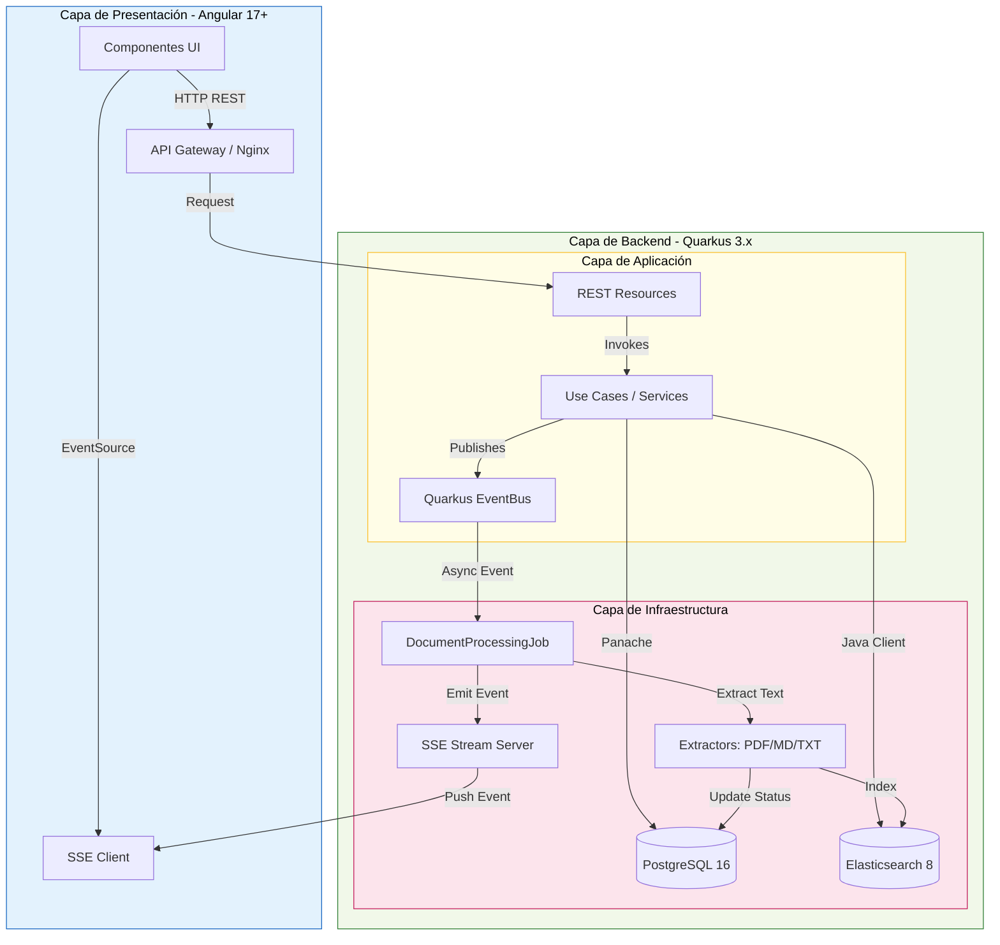
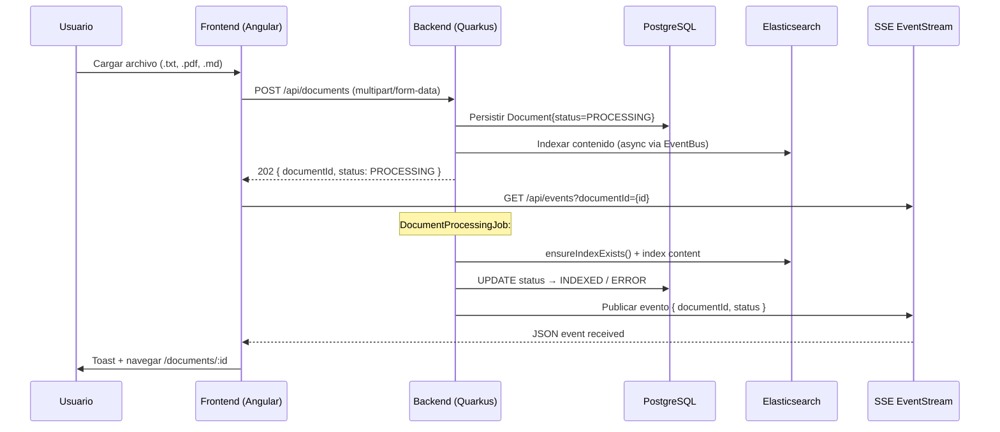

# Documentos Técnicos - Arquitectura del Sistema

> **Ubicación:** `docs/architecture.md` | **Finalidad:** Diagrama + justificaciones tecnológicas.
> **Referencia obligatoria:** `AGENTS.md§10`, `AGENTS.md§15`, `AGENTS.md§17`

---

## 1. Visión General

**VisorDocsKATA** es una aplicación web full-stack diseñada para cargar, indexar y buscar documentos técnicos (TXT, PDF, Markdown) con metadatos. La arquitectura sigue los principios de **Clean Architecture** con separación clara entre dominio, aplicación, infraestructura e interfaz.

El sistema permite:
1. Cargar documentos con metadatos (título, autor, categoría, etiquetas, versión)
2. Procesar e indexar documentos de forma asíncrona
3. Buscar utilizando Full-Text Search en Elasticsearch 8
4. Visualizar contenido sin descargar el archivo
5. Actualizar estado en tiempo real usando Server-Sent Events (SSE)

---

## 2. Diagrama de Arquitectura

---

## 3. Stack Tecnológico y Justificaciones

| Capa | Tecnología | Versión | Justificación |
|------|------------|---------|---------------|
| **Backend** | **Quarkus** | 3.x LTS | Arranque ultrarrápido, reactive nativo, Hibernate Panache simplifica repositorios, soporte nativo SSE con `@RestStreamElementType` |
| **Frontend** | **Angular** | 17+ | Framework opinionado, TypeScript nativo, RxJS para SSE y state reactivo, integración fácil con HTTP y EventSource |
| **API** | **REST (JAX-RS / RESTEasy Reactive)** | — | Contratos claros, validated DTOs, error handling unificado (RFC 7807) |
| **Base de datos** | **PostgreSQL** | 16 | Relacional confiable, Persistence con Hibernate Panache, UUIDs nativos |
| **Motor búsqueda** | **Elasticsearch 8.x** | 8.x | Full-Text Search maduro, highlighting nativo, multi-field query, cliente Java oficial |
| **Tiempo real** | **SSE (Server-Sent Events)** | — | Patrón unidireccional (servidor→cliente), más liviano que WebSocket para este caso |
| **Cola asíncrona** | **Quarkus EventBus + @Blocking workers** | — | Procesamiento fuera del hilo de request, no bloquea la API |
| **ORM** | **Hibernate ORM with Panache** | — | Active Record sencillo, menos boilerplate, transacciones automáticas |
| **Contenedores** | **Docker + Docker Compose** | — | Despliegue reproducible, todos los servicios en contenedores isolados |

## 3.1. Decisiones clave y por qué

- **Quarkus sobre Spring Boot:** Arranque más rápido (~100ms vs ~2s), native memory footprint bajo, reactive por defecto. Ideal para Docker y orquestación.
- **Elasticsearch sobre búsqueda SQL LIKE:** La restricción `AGENTS.md§53` prohíbe `LIKE` no indexado. ES 8 proporciona búsquedaFull-Text indexada, highlighting y respuestas en el rango 400-1000ms objetivo.
- **SSE sobre WebSocket:** El patrón es unidireccional (servidor→cliente notificando estado). SSE es más simple, usa estándar HTTP, y no requiere handshake de WS ni framing binario.
- **Docker Compose sobre k8s:** El objetivo es KATA/learning, no producción a escala. Docker Compose levanta PG, ES y backend en segundos para desarrollo local.
- **Clean Architecture:** Separa preocupaciones (dominio puro sin dependencias externas), facilita tests unitarios con Mockito y tests de integración con Testcontainers.
- **Low-level REST client para ES:** Evita `media_type_header_exception` con ES 8.x al usar cliente de alto nivel (9.x) contra servidor 8.x. Se usa `quarkus-elasticsearch-rest-client` + `elasticsearch-rest-client:8.13.0` para operaciones HEAD/PUT/POST directas.
- **nginx resolver + variable $backend:** Docker DNS resuelve `backend` solo en runtime; variable en `proxy_pass` fuerza resolución dinámica vs cache al inicio.
- **nginx location order:** `/api/` y `/api/events` antes de `location /` evita que `try_files` intercepte rutas API.
- **flush() tras persist:** Garantiza visibilidad del documento en BD antes de publicar evento EventBus para procesamiento asíncrono.
- **Sanitización null bytes (`\u0000`):** PostgreSQL UTF-8 rechaza bytes nulos; se eliminan en extracción y mensajes de error.
- **Encoding fallback UTF-8 → ISO-8859-1:** Archivos TXT legacy pueden no ser UTF-8; fallback evita `MalformedInputException`.

---

## 4. Flujo de Datos Completo

---

## 5. Decisiones de Diseño Importantes

| Área | Decisión | Alternativa descartada | Motivo |
|------|----------|----------------------|--------|
| **Búsqueda** | ES Full-Text `multi_match` | SQL `LIKE` | Prohibido por `AGENTS.md§53`; no indexado, lento, sin highlighting |
| **Estado POST** | Responder 202 {documentId, PROCESSING} inmediatamente | Esperar procesamiento completo | `AGENTS.md§54`: "respuesta inmediata en carga antes de que termine el procesamiento" |
| **Comunicación tiempo real** | SSE | WebSocket | `AGENTS.md§44`: SSE "suficiente y más liviano que WebSocket para este caso"; unidireccional basta |
| **Persistencia** | Hibernate Panache + UUID | JPA nativo + secuencias | `AGENTS.md§127-171`: UUID nativo, menos boilerplate, migraciones automáticas |
| **Indexado ES** | `ensureIndexExists()` al iniciar | Indexar solo después de primer doc | Evita fallos en el primer documento; creación idempotente del índice |
| **Configuración sensible** | Variables de entorno (`${VAR:default}`) | Hardcodeados | `AGENTS.md§56`: "Sin secretos hardcodeados" |
| **Errores backend** | Respuesta JSON unificada con `code`/`message`/`correlationId` | Stack traces en producción | Mejor DX para consumidores, rastreo distribuido |

---

## 6. Consideraciones de Rendimiento

- **Objetivo búsqueda:** p95 < 1000 ms en `GET /api/documents/search?q=...` (RF-003)
- **Latencia objetivo:** 400 ms – 1000 ms (RF-003§3)
- **Factores que afectan:**
  - Tamaño del índice ES (shards, replicas)
  - Cantidad de documentos indexados
  - Configuración `quarkus.elasticsearch.java-client.compatibility-mode` (actualmente `false` para evitar error de headers HTTP)
  - Retry logic en `onStartup()` (3 intentos, 2s delay) para no bloquear arranque

---

## 7. Estado de Implementación (Checklist)

| Componente | Estado | Detalles |
|------------|--------|----------|
| **Backend Quarkus** | ✅ Completado | Compila, tests pasan, endpoints operativos |
| **Frontend Angular** | ✅ Completado | Servido por nginx, proxy API funcional |
| **PostgreSQL** | ✅ Completado | Persistencia con Panache, UUIDs, flush() |
| **Elasticsearch 8.x** | ✅ Completado | Low-level REST client, index auto-create, search + highlight |
| **Async Processing** | ✅ Completado | EventBus + @Blocking, TXT/PDF/MD, encoding fallback, sanitización |
| **SSE Real-time** | ✅ Completado | EventSource nativo, toast + navegación auto |
| **Docker Compose** | ✅ Completado | 4 servicios (PG, ES, Backend, Frontend) healthy |
| **Tests** | ✅ Completado | Unitarias (9 ES tests) + Integración (@QuarkusTest) |
| **Documentación** | ⚠️ Parcial | architecture.md, ia.md ✅; README pendiente |
| **Benchmark k6** | ✅ Completado | p95 = 23.26ms (Objetivo < 1000ms) |

---

## 8. Próximos Pasos de Arquitectura

- [x] Implementar benchmark k6 y medir latencias de búsqueda (objetivo p95 < 1000ms) ✅ (p95 = 23.26ms)
2. [ ] Redactar README con instrucciones de setup, ejecución y variables de entorno
3. [ ] (Opcional) Añadir métricas Prometheus/Grafana para observabilidad
4. [ ] (Opcional) Implementar rate limiting y autenticación JWT

---

*Generado a partir de `KATA_29_sep_requerimientos_LLM.md` y `AGENTS.md` | Versión: 1.0 | Fecha: 2026-09-29*